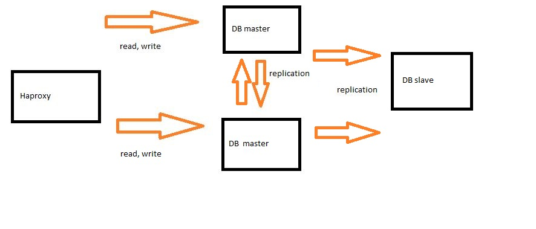

# MariaDB: Replication installation guide



## Steps

### Database replication

1. Install MariaDB
2. Start and config MariaDB on primary server
3. config master firewall
4. Start and config MariaDB on replica server
5. Test MariaDB

### Reverse proxy

1. Install proxy
2. config proxy
3. test proxy

## Install MariaDB

The repository is already there so we just have to install some packages.

```bash
sudo dnf install MariaDB-server MariaDB-backup
```

## Start/config primary server

Edit config file with following:

```cnf
[mariadb]
log_bin
server_id=1
log-basename=master
binlog-format=mixed
```

> `server_id` is a unique value

Start the dbserver:
> If already running, restart dbserver to apply config

```bash
systemctl enable mariadb --now
```

There should be at least 2 users created:

1. replication user

Create user accounts:
> each account should be created on the master so replication can make these accounts on the slaves.

### replication user

```sql
CREATE USER 'repl'@'slave_ip' IDENTIFIED BY 'test';
```

Grant required privileges.

```sql
GRANT REPLICATION SLAVE
ON *.* TO repl@'slave_ip';
```

## Start/config replica server

Edit config file with following:

```cnf
[mariadb]
log_bin
server_id=2
log-basename=master
binlog-format=mixed
```

> `server_id` is a unique value

```sql
SHOW SLAVE STATUS;
+--------------------+----------+--------------+------------------+
| File               | Position | Binlog_Do_DB | Binlog_Ignore_DB |
+--------------------+----------+--------------+------------------+
| master1-bin.000096 |      568 |              |                  |
+--------------------+----------+--------------+------------------+
```

> take notes of the filename and position

```sql
CHANGE MASTER TO
  MASTER_HOST='master_ip',
  MASTER_USER='replication_user',
  MASTER_PASSWORD='test',
  MASTER_PORT=3306,
  MASTER_LOG_FILE='master-bin.000096',
  MASTER_LOG_POS=568,
  MASTER_CONNECT_RETRY=10;
```

> With fresh master, you don't need to specify `MASTER_LOG_FILE` and `MASTER_LOG_POS`

### Start replication

```sql
START SLAVE;
```

```sql
SHOW SLAVE STATUS;
```

> If replication is running properly, both `Slave_IO_Running` and `Slave_SQL_Running` should be `Yes`.  
> Momenteel hebben we een master-slave setup. Om hier nu een master-master setup van te maken moeten we er voor zorgen dat er replicatie is tussen master1 en master2.

## Test replication

<https://mariadb.com/docs/deploy/topologies/primary-replica/enterprise-server-10-3/test-es/>

## Install proxy

I chose to go with `haproxy`.  
To install this proxy just use dnf

```bash
sudo dnf install haproxy
```

## Config proxy

### Make user

  name: haproxy  
  group: haproxy

### Edit configuration file

```cnf
# /etc/haproxy/haproxy.cfg

defaults
  mode  tcp
  option mysql-check user haproxy_health
frontend frontend
  # read-requests will arrive at port 3100
  bind *:3100
  # write-requests will arrive at port 3200
  bind *:3200
  # if write send to masters
  use_backend db_masters if { dst_port 3200 }
  # if read sent to slaves
  default_backend db_slaves

backend db_masters
  server master1 10.8.131.120:3306

backend db_slaves
  server slave1 10.8.131.121:3306
  server master1 10.8.131.120:3306
```

### (re)start service

```bash
sudo systemctl enable haproxy --now
```

### SELinux

```bash
setsebool haproxy_connect_any 1
```
